# OpenManus 代理系统关系图

```mermaid
graph TD
    %% Main Entry Points
    main.py --> Manus[Manus Agent]
    run_mcp.py --> MCPServer[MCPServer]
    run_flow.py --> PlanningFlow[PlanningFlow]

    %% Agent Hierarchy
    BaseAgent[BaseAgent] --> ReActAgent[ReActAgent]
    ReActAgent --> ToolCallAgent[ToolCallAgent]
    ToolCallAgent --> Manus
    ToolCallAgent --> SWEAgent[SWEAgent]
    ToolCallAgent --> MCPAgent[MCPAgent]
    ToolCallAgent --> BrowserAgent[BrowserAgent]

    %% Flow System
    BaseFlow[BaseFlow] --> PlanningFlow
    FlowFactory[FlowFactory] --> PlanningFlow

    %% Tool System
    BaseTool[BaseTool] --> ToolCollection[ToolCollection]
    ToolCollection --> PythonExecute[PythonExecute]
    ToolCollection --> BrowserUseTool[BrowserUseTool]
    ToolCollection --> StrReplaceEditor[StrReplaceEditor]
    ToolCollection --> Terminate[Terminate]
    ToolCollection --> PlanningTool[PlanningTool]

    %% Sandbox System
    BaseSandboxClient[BaseSandboxClient] --> LocalSandboxClient[LocalSandboxClient]
    LocalSandboxClient --> DockerSandbox[DockerSandbox]
    DockerSandbox --> SandboxManager[SandboxManager]
    DockerSandbox --> AsyncDockerizedTerminal[AsyncDockerizedTerminal]

    %% LLM System
    LLM[LLM] --> TokenCounter[TokenCounter]

    %% Configuration
    Config[Config] --> AppConfig[AppConfig]
    AppConfig --> LLMSettings[LLMSettings]
    AppConfig --> SandboxSettings[SandboxSettings]
    AppConfig --> BrowserSettings[BrowserSettings]
    AppConfig --> SearchSettings[SearchSettings]
    AppConfig --> MCPSettings[MCPSettings]

    %% Schema
    Message[Message] --> Memory[Memory]
    ToolCall[ToolCall] --> Message
    Function[Function] --> ToolCall

    %% Relationships
    Manus --> ToolCollection
    Manus --> LLM
    Manus --> Memory
    Manus --> BrowserContextHelper[BrowserContextHelper]

    SWEAgent --> ToolCollection
    SWEAgent --> LLM
    SWEAgent --> Memory

    MCPAgent --> ToolCollection
    MCPAgent --> LLM
    MCPAgent --> Memory

    BrowserAgent --> ToolCollection
    BrowserAgent --> LLM
    BrowserAgent --> Memory
    BrowserAgent --> BrowserContextHelper

    PlanningFlow --> BaseAgent
    PlanningFlow --> LLM
    PlanningFlow --> PlanningTool

    MCPServer --> BaseTool
    MCPServer --> FastMCP[FastMCP]

    %% Style
    classDef entry fill:#f9f,stroke:#333,stroke-width:2px;
    classDef agent fill:#bbf,stroke:#333,stroke-width:2px;
    classDef tool fill:#bfb,stroke:#333,stroke-width:2px;
    classDef sandbox fill:#fbb,stroke:#333,stroke-width:2px;
    classDef llm fill:#fbf,stroke:#333,stroke-width:2px;
    classDef config fill:#ffb,stroke:#333,stroke-width:2px;
    classDef schema fill:#bff,stroke:#333,stroke-width:2px;

    class main.py,run_mcp.py,run_flow.py entry;
    class BaseAgent,ReActAgent,ToolCallAgent,Manus,SWEAgent,MCPAgent,BrowserAgent agent;
    class BaseTool,ToolCollection,PythonExecute,BrowserUseTool,StrReplaceEditor,Terminate,PlanningTool tool;
    class BaseSandboxClient,LocalSandboxClient,DockerSandbox,SandboxManager,AsyncDockerizedTerminal sandbox;
    class LLM,TokenCounter llm;
    class Config,AppConfig,LLMSettings,SandboxSettings,BrowserSettings,SearchSettings,MCPSettings config;
    class Message,Memory,ToolCall,Function schema;
```

## 代理系统说明

### 1. 基础代理类
- `BaseAgent`: 所有代理的基类，定义基本属性和行为
- `ReActAgent`: 实现思考-行动循环的代理
- `ToolCallAgent`: 支持工具调用的代理

### 2. 专业代理
- `SWEAgent`: 软件工程代理，专注于代码相关任务
- `MCPAgent`: 模型上下文协议代理，处理工具注册和执行
- `BrowserAgent`: 浏览器交互代理，处理网页操作

### 3. 通用代理
- `Manus`: 通用代理实现，集成多种工具和能力

### 4. 工具系统
- `BaseTool`: 工具基类
- `ToolCollection`: 工具集合管理
- 具体工具实现：
  - `PythonExecute`: Python代码执行
  - `BrowserUseTool`: 浏览器操作
  - `StrReplaceEditor`: 文本编辑
  - `Terminate`: 任务终止

## 代理职责说明

### SWEAgent
- 代码分析：分析代码结构和质量
- 代码生成：生成新代码或修改现有代码
- 代码审查：检查代码质量和潜在问题
- 错误修复：识别和修复代码中的错误

### MCPAgent
- 工具注册：管理可用工具的注册和配置
- 工具执行：处理工具调用和执行
- 协议处理：管理代理间的通信协议

### BrowserAgent
- 页面导航：控制浏览器页面跳转
- 元素交互：与页面元素进行交互
- 表单填写：自动填写网页表单
- 数据提取：从网页提取所需数据

### Manus
- 任务解决：分析并解决各种任务
- 工具集成：管理和协调多个工具
- 上下文管理：维护对话和任务上下文
