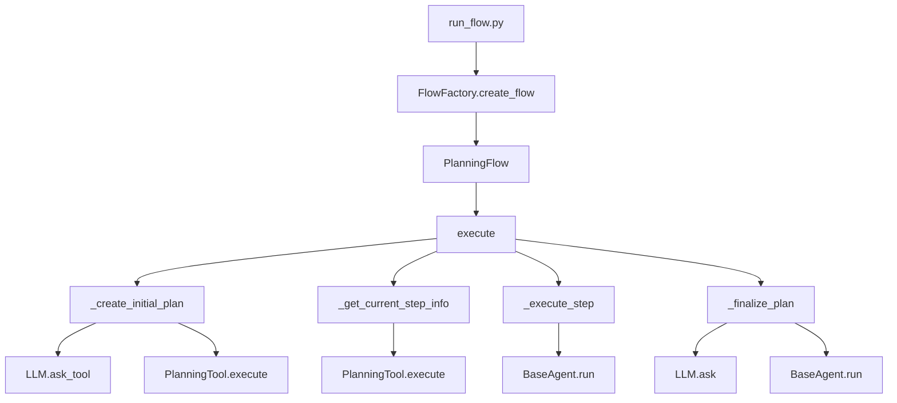
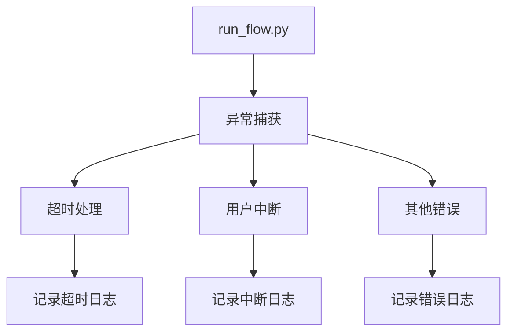

# run_flow.py 函数调用关系说明

## 1. 主要调用流程

## 2. 详细调用关系说明

### 2.1 主流程调用链
1. `run_flow()` 函数
   - 创建 Manus 智能体
   - 调用 `FlowFactory.create_flow()`
   - 调用 `flow.execute()`

2. `FlowFactory.create_flow()`
   - 根据 flow_type 创建对应的 Flow 实例
   - 目前支持 `PlanningFlow`

3. `PlanningFlow.execute()`
   - 调用 `_create_initial_plan()`
   - 循环调用 `_get_current_step_info()`
   - 调用 `_execute_step()`
   - 调用 `_finalize_plan()`

### 2.2 计划创建流程
1. `_create_initial_plan()`
   - 调用 `LLM.ask_tool()`
   - 调用 `PlanningTool.execute()`

2. `PlanningTool.execute()`
   - 创建计划
   - 更新计划状态
   - 管理计划步骤

### 2.3 步骤执行流程
1. `_get_current_step_info()`
   - 调用 `PlanningTool.execute()`
   - 获取当前步骤信息
   - 更新步骤状态

2. `_execute_step()`
   - 调用 `BaseAgent.run()`
   - 执行具体步骤
   - 更新执行结果

### 2.4 计划完成流程
1. `_finalize_plan()`
   - 调用 `LLM.ask()`
   - 或调用 `BaseAgent.run()`
   - 生成最终总结

## 3. 关键类和方法说明

### 3.1 FlowFactory
- `create_flow()`: 创建流程实例
- 支持多种流程类型
- 管理流程配置

### 3.2 PlanningFlow
- `execute()`: 执行主流程
- `_create_initial_plan()`: 创建初始计划
- `_get_current_step_info()`: 获取当前步骤
- `_execute_step()`: 执行步骤
- `_finalize_plan()`: 完成计划

### 3.3 PlanningTool
- `execute()`: 执行计划操作
- 管理计划状态
- 处理计划步骤

### 3.4 BaseAgent
- `run()`: 执行具体任务
- 处理用户输入
- 生成执行结果

## 4. 错误处理流程

## 5. 资源管理

1. 智能体资源
   - 创建时初始化
   - 执行时使用
   - 异常时清理

2. 计划资源
   - 创建时分配
   - 执行时更新
   - 完成时释放

3. 工具资源
   - 按需创建
   - 共享使用
   - 自动清理
